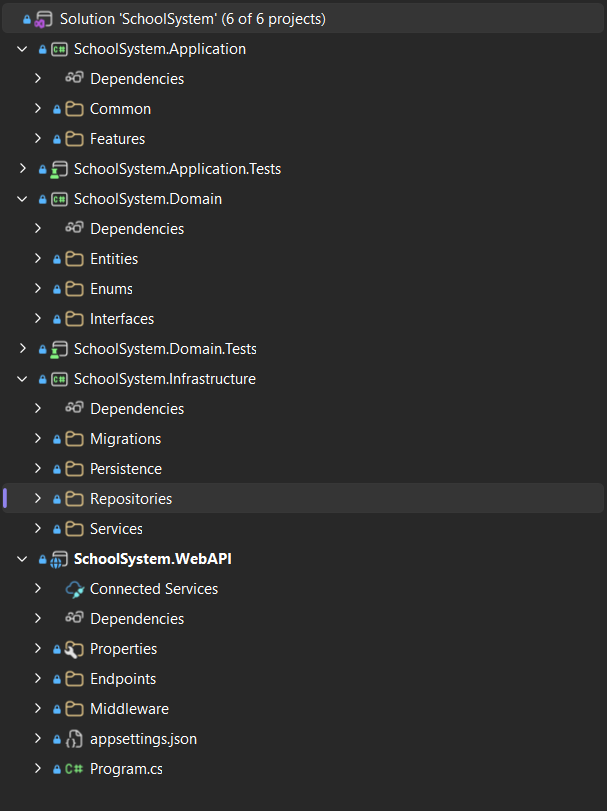
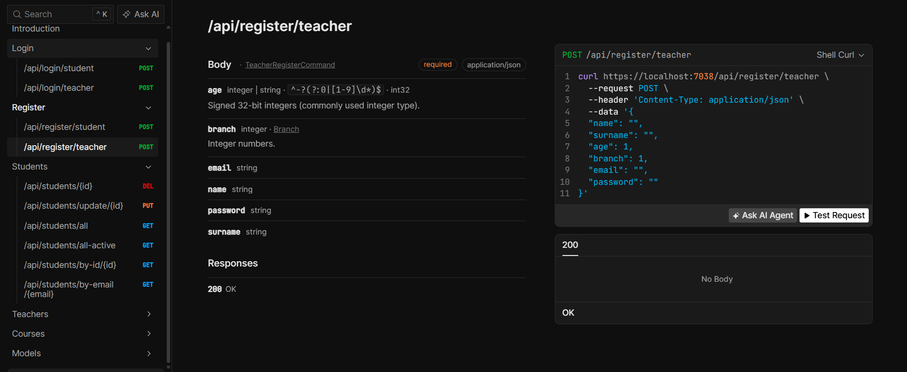
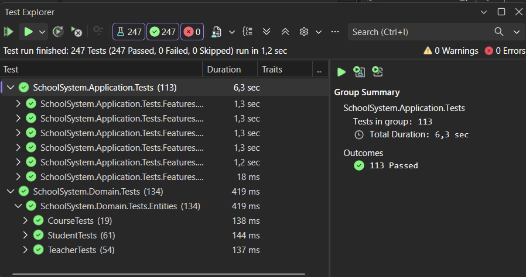

# SchoolSystem Web API

Clean Architecture prensipleriyle geliştirilmiş, .NET tabanlı bir okul/öğrenci yönetim sistemi Web API projesi.

## 📐 Mimari

Proje, **Clean Architecture** yaklaşımıyla katmanlara ayrılmıştır ve **Rich Domain Model** (Zengin Domain Modeli) kullanılmıştır. Bu sayede iş kuralları entity'lerin içinde kapsüllenmiş, domain katmanı dış katmanlara bağımlı olmadan kendi bütünlüğünü koruyabilecek şekilde tasarlanmıştır.

Solution 6 projeden oluşmaktadır:

```
SchoolSystem
├── SchoolSystem.Domain
├── SchoolSystem.Domain.Tests
├── SchoolSystem.Application
├── SchoolSystem.Application.Tests
├── SchoolSystem.Infrastructure
└── SchoolSystem.WebAPI
```


### Domain Katmanı
- **Entities**: Rich domain model prensibiyle yazılmış, kendi iş kurallarını (invariant) kendi içinde barındıran entity sınıfları (Teacher, Student, Course, StudentCourse vb.)
- **Enums**: Domain'e özgü sabit değer kümeleri (örn. Branch)
- **Interfaces**: Sadece entity'leri ilgilendiren, domain'e özgü design interface'leri (örn. entity davranışlarını/sözleşmelerini tanımlayan interface'ler). Repository interface'leri bu katmanda yer almaz.

### Application Katmanı
- Feature bazlı organizasyon (CQRS'e yakın bir yapı — Features klasörü altında)
- **Interfaces**: Repository interface'leri bu katmanda tanımlanır (persistence katmanından bağımsız soyutlamalar sağlayarak Dependency Inversion prensibini uygular; implementasyonları Infrastructure katmanında yer alır)
- **JWT Authentication** ve **JWT Token** üretim/yönetim mekanizmaları
- Common: Ortak davranışlar, response wrapper'lar, exception handling vb.

### Infrastructure Katmanı
- **Persistence**: DbContext ve veritabanı yapılandırmaları
- **Migrations**: Code-First migration yöntemi ile veritabanı şeması yönetimi
- **Repositories**: Domain katmanındaki repository interface'lerinin somut implementasyonları
- **Services**: Dış servis entegrasyonları ve altyapısal servisler

### WebAPI Katmanı
- **Endpoints**: Minimal API / Controller tabanlı endpoint tanımları
- **Middleware**: Custom middleware bileşenleri (örn. exception handling, logging)
- Program.cs üzerinden dependency injection, servis kayıtları ve middleware pipeline yapılandırması

## 🧱 Domain Modeli

Aşağıdaki temel entity'ler **migration yöntemi** ile veritabanına yansıtılmıştır:

- **Teacher** — Öğretmen bilgileri
- **Student** — Öğrenci bilgileri
- **Course** — Ders/kurs bilgileri
- **StudentCourse** — Öğrenci–Ders ilişkisini temsil eden many-to-many bağlantı entity'si

## 🔐 Kimlik Doğrulama

Proje **JWT (JSON Web Token)** tabanlı authentication kullanmaktadır:

- Kullanıcılar (öğrenci/öğretmen) login endpoint'leri üzerinden giriş yapar
- Başarılı girişte JWT token üretilir ve client'a döndürülür
- Korumalı endpoint'ler bu token ile yetkilendirilir

## 🌐 API Endpoints

Swagger/Scalar üzerinden dokümante edilen başlıca endpoint grupları:

Teacher, Student, Course için CRUD işlemleri yapılmıştır. Delete sisteminde Soft-Delete kullanılmaktadır.

**Örnek: `POST /api/register/teacher`**



## ✅ Test Kapsamı

Proje, **Unit Test** konusunun pekiştirilmesi amacıyla kapsamlı bir test paketi içerir.

**Son test çalıştırma sonucu: 247 test, 247 başarılı, 0 başarısız, 0 atlanmış (1,2 sn)**



Domain katmanındaki testler, Rich Domain Model'in doğru kurallar altında çalıştığını (invariant kontrolü, geçersiz veri senaryoları vb.) doğrulamaya odaklanırken; Application katmanı testleri feature/use-case bazlı iş akışlarını ve JWT authentication mekanizmalarını kapsar.

## 🛠️ Kullanılan Teknolojiler & Kavramlar

- .NET (C#)
- Clean Architecture
- Rich Domain Model (Domain-Driven yaklaşım)
- Repository Pattern (Interface Segregation ile Application katmanında tanımlı, Infrastructure'da implemente edilmiş)
- Entity Framework Core — Code-First Migrations
- JWT Authentication & Authorization
- xUnit / Unit Testing
- RESTful API tasarımı

## 🚀 Proje Yapısı Özeti

```
SchoolSystem.Domain
 ├── Entities/         → Rich domain entity'leri
 ├── Enums/            → Branch vb. domain enum'ları
 └── Interfaces/       → Sadece entity'lere özgü design interface'leri

SchoolSystem.Application
 ├── Common/           → Ortak yapılar 
 ├── Interfaces/       → Repository interface'leri 
 └── Features/         → Feature bazlı iş mantığı 

SchoolSystem.Infrastructure
 ├── Migrations/       → EF Core migration dosyaları
 ├── Persistence/       → DbContext ve konfigürasyonlar
 ├── Repositories/       → Repository implementasyonları
 └── Services/          → Altyapısal servisler

SchoolSystem.WebAPI
 ├── Endpoints/         → API endpoint tanımları
 ├── Middleware/         → Custom middleware'ler
 └── Program.cs         → Uygulama giriş noktası ve DI konfigürasyonu
```

## 📌 Notlar

Bu proje, Clean Architecture, Rich Domain Model, Repository Pattern, JWT Authentication ve Unit Test konularını uygulamalı olarak pekiştirmek amacıyla geliştirilmiştir ve hâlâ geliştirme aşamasında olup Handler sınıflarının testleri henüz tamamlanmamıştır. Bazı özel hata (Exception) sınıfları eksik olsa da proje şu an stabil, çalışır ve test edilebilir durumdadır.