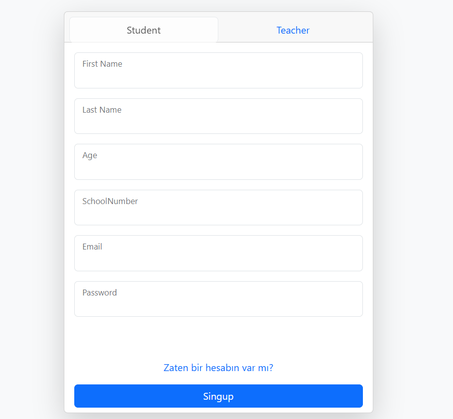
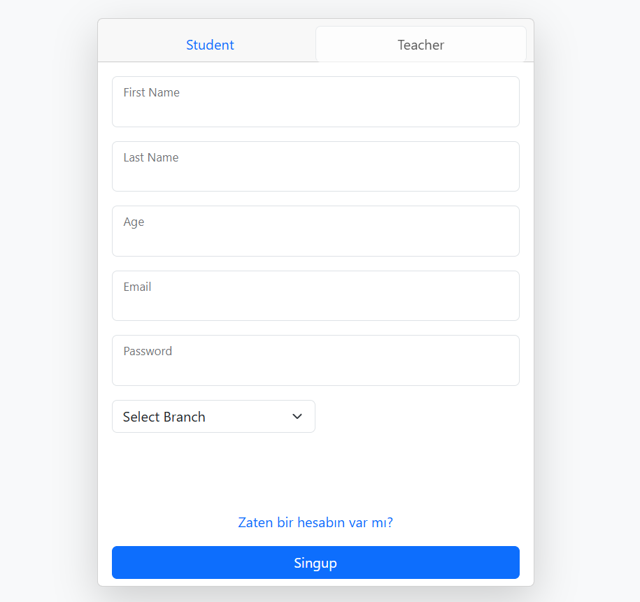
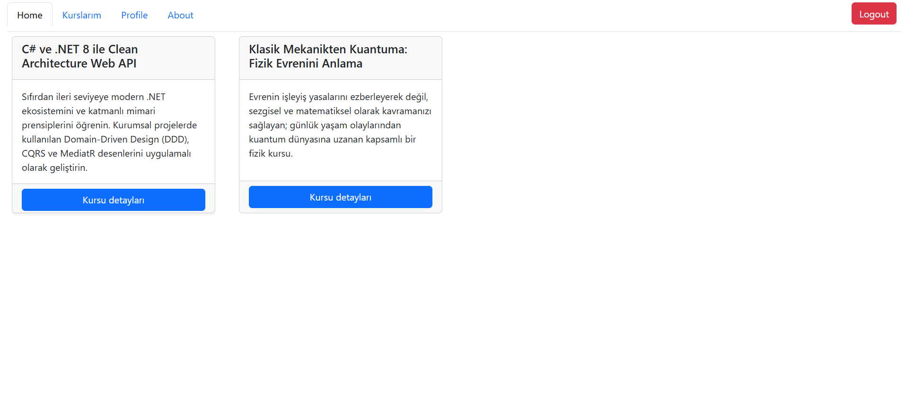
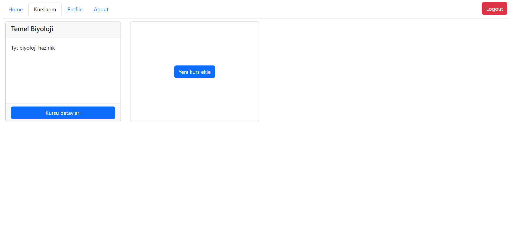
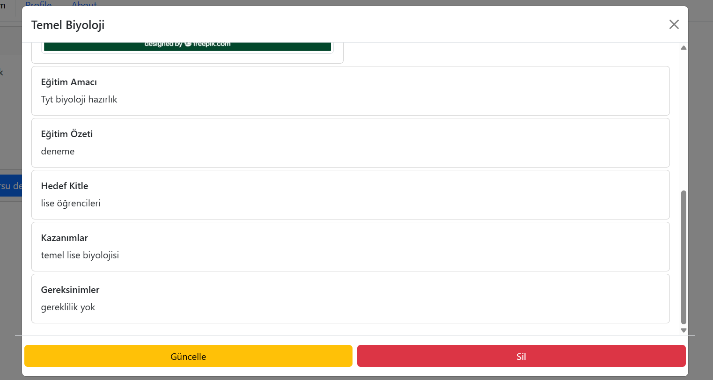

# 🅰️ School Management System - Angular Frontend

Bu proje, Okul Yönetim Sistemi projesinin Angular kullanılarak geliştirilmiş ön yüz (UI) uygulamasıdır. Kullanıcı rolüne (Öğrenci / Öğretmen) göre dinamik arayüz sunar.

## 🧰 Kullanılan Teknolojiler

- **Framework:** Angular (v21+)
- **Dil:** TypeScript
- **Styling:** CSS3 & Bootstrap
- **Veri İletişimi:** RxJS & HttpClient Module
- **Yönlendirme:** Angular Router & Auth Guards

## 🔑 Öne Çıkan Arayüz Özellikleri

- **Dinamik Auth & Role Switching:** 
  - Öğrenci ve Öğretmen için tek ekranda tab geçişli Giriş (Login) ve Kayıt (Signup) formları.
  - Rol bazlı navigasyon ve menü görünümü.
  <p align="center">
    
    
  </p>
- **Kurs Kataloğu (Home):** Sistemdeki tüm aktif kursların kart yapısında özeti ve detay butonları.
  <p align="center">
    
  </p>
- **Öğretmen Yönetim Paneli (Kurslarım):**
  - Giriş yapan öğretmenin kendi açtığı kursların listelenmesi.
  - Yeni kurs ekleme kartı ve dinamik yönlendirmesi.
  <p align="center">
    
    
  </p>
- **Profil & Detay Sayfaları:** Kurs içerikleri ve eğitmen bilgilerini görüntüleme.

## Mimari

- Uygulama, sorumlulukların ayrılması (Separation of Concerns) prensibine uygun olarak modüler bir klasör hiyerarşisiyle tasarlanmıştır:

 ```
   src/app/
    ├── components/          # Arayüz Bileşenleri (UI Components)
    │   ├── login/           # Kullanıcı giriş ekranı bileşeni
    │   ├── register/        # Öğrenci / Öğretmen tab'lı kayıt ekranı
    │   ├── student/         # Öğrenciye özel kurs ve profil panelleri
    │   └── teacher/         # Öğretmene özel kurs yönetim panelleri
    │
    ├── models/              # Tip ve Veri Tanımları (TypeScript Interfaces/Types)
    │   ├── auth/            # Login/Register request ve response modelleri
    │   ├── course/          # Kurs entity ve DTO modelleri
    │   ├── student/         # Öğrenci profil modelleri
    │   └── teacher/         # Öğretmen profil modelleri
    │
    ├── services/            # API Servis Katmanı (Data Fetching & State)
    │   ├── auth/            # Kimlik doğrulama API istekleri
    │   ├── course/          # Kurs CRUD operasyon servisleri
    │   ├── student/         # Öğrenci API servisleri
    │   ├── teacher/         # Öğretmen API servisleri
    │   └── enum/            # Sabit veri tipleri ve enum'lar
    │
    ├── auth.guard.ts        # Yetkisiz sayfa erişimlerini engelleyen Route Guard
    └── jwt.interceptor.ts   # Tüm HTTP isteklere JWT Token ekleyen Interceptor
  ```